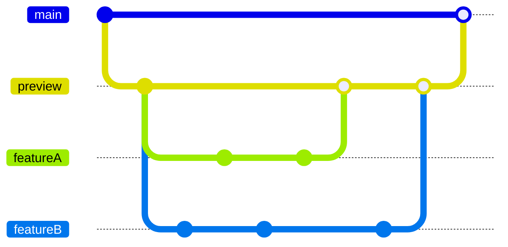
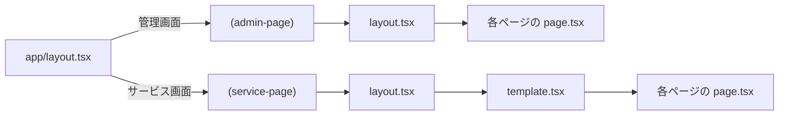

## Eleven Labo | ベストイレブン研究所

See https://eleven-labo.vercel.app/

<table>
  <tr>
    <td></td>
    <td></td>
  </tr>
</table>


## 使用技術・利用サービス

<div style="display:flex; gap:8px">
  
  
  
  
  
  
  
  
  
</div>


## Getting Started

開発には VSCode・devContainer(Docker) を利用しています

```sh
# 1. VScode・devContainer を起動

# 2. .env.local を作成
$ cp .env.dist .env.local

# 3. 開発環境 起動 (http://localhost:3000)
$ yarn dev

# 4. Storybook 起動 (http://localhost:6006)
$ yarn storybook
```


## 環境変数

値についてはコードオーナーから受領してください

| Key | Description |
| ---- | ---- |
| NEXT_PUBLIC_CLERK_PUBLISHABLE_KEY | Clerkの利用に必要 |
| CLERK_SECRET_KEY | Clerkの利用に必要 |
| WEBHOOK_SECRET | Clerkからのwebhookの認証に必要 |
| POSTGRES_URL | Vercel Storage の DB 利用に必要 |
| POSTGRES_PRISMA_URL | Vercel Storage の DB 利用に必要 |
| POSTGRES_URL_NO_SSL | Vercel Storage の DB 利用に必要 |
| POSTGRES_URL_NON_POOLING | Vercel Storage の DB 利用に必要 |
| POSTGRES_USER | Vercel Storage の DB ユーザ名 |
| POSTGRES_HOST | Vercel Storage の DB ホスト名 |
| POSTGRES_PASSWORD | Vercel Storage の DB パスワード |
| POSTGRES_DATABASE | Vercel Storage の DB 名 |
| API_FOOTBALL_API_KEY | API Football の API KEY |
| GA_ID | GoogleAnalytics の ID |


## 管理者向け

#### 各種管理コンソール・開発資料

- [Vercel | Eleven Labo](https://vercel.com/eleven-labo/eleven-labo)
- [Clerk | Eleven Labo](https://dashboard.clerk.com/apps/app_2iii3RLAoJrF3EfkSUtBqWRtcGl/instances/ins_2iii3P9Y06xFeEr9Di1hvyPVDGA)
- [Figma | Eleven Labo](https://www.figma.com/files/team/1378738534124220787/project/239964492?fuid=1378738532096732362)
- [Slack | Eleven Labo](https://app.slack.com/client/T07DC044G0K/C07DEHMA1V2)
- [Notion | Eleven Labo](https://www.notion.so/8a1c7f326a074d19b8ea66bc5bd22937)


#### ブランチ戦略

Vercel へのデプロイの都合で、デフォルトブランチを `preview` とします。
`main` ブランチは、本番リリース時にマージするものとします。




#### データベース管理

```sh
# 現在のDB構成を prisma/schema.prisma に反映する
$ npx prisma db pull

# DB構成の変更、反映
# prisma/schema.prisma を変更する
$ npx prisma db push
$ npx prisma generate

# 初期データ（Seed）の更新
$ yarn prisma db seed

# マイグレーションの実行
$ npx prisma migrate deploy

# DB管理コンソールの起動 (http://localhost:5555)
$ npx prisma studio

# prisma.schema の format
$ npx prisma format
```

#### ディレクトリ構成

```
eleven-labo
├── .devcontainer           # 開発環境の設定ファイル群
│   ├── compose.yaml
│   ├── devcontainer.json
│   └── Dockerfile
├── .storybook              # storybookの設定ファイル群
│   ├── main.ts
│   └── preview.tsx
├── prisma                  # データベースの設定ファイル群
│   ├── schema.prisma       # データベーススキーマ設定
│   └── seed.ts             # 初期データの生成処理
├── public                  # 静的ファイル置き場（基本はルートに平置き）
│   ├── ogp                 # OGPに関する静的ファイル置き場
│   └── readme              # READMEに関する静的ファイル置き場
├── src
│   ├── app
│   ├── components          # コンポーネント
│   ├── constants           # 定数
│   ├── fixtures            # 固定データ
│   ├── stories             # storybook
│   ├── styles              # CSS
│   ├── types               # 型定義
│   ├── utils               # 汎用処理
│   ├── middleware.ts       # Clerk認証の設定ファイル
│   └── prisma.ts           # Prisma(ORM)の設定ファイル
├── .env.dist               # 環境変数のキー一覧
├── .env.local              # 環境変数の設定（開発環境）
├── biome.json
├── next.config.mjs
├── package.json
├── tsconfig.json
├── vercel-ignore-build-step.sh # Next.js で PullRequest のたびにデプロイされるのを防ぐ設定
├── vitest.config.ts
└── yarn.lock
```

#### ページレンタリングの流れ


